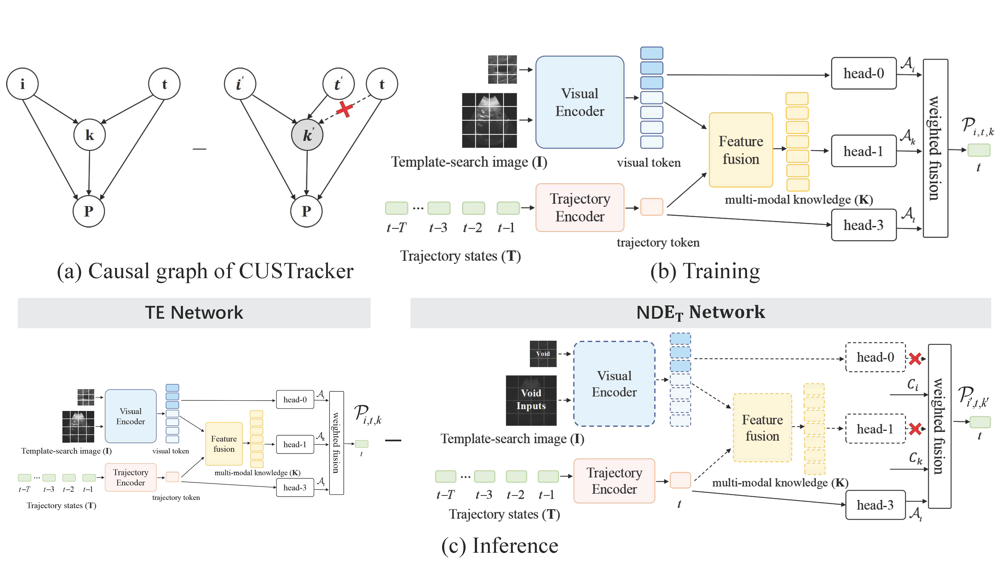

<div align="center">

# CUSTrack: A Causal View on Ultrasound Motion Tracking with Historical Trajectory

The official implementation for the paper: <br/> [_CUSTrack: A Causal View on Ultrasound Motion Tracking
 with Historical Trajectory_]().


<a href="https://shkzhang.github.io/CUSTrack/"></a>
<a href="https://huggingface.co/shkzhang/CUSTrack"></a>
<a href="https://wandb.ai/shukang/tracking/reports/CUSTrack-Training-Report--Vmlldzo4OTYyNTI5?accessToken=t0x46zti2tnutcfchkqftjl9u45sqhtmnqczbtjyzjdt4thqqsx6ty9yvicbms39"></a>
<a href="https://github.com/shkzhang/CUSTrack?tab=MIT-1-ov-file"></a>


<p align="center">
  
</p>

</div>

 **Abstract:**
 Real-time tissue tracking is a foundation task in liver ultra
sound applications. Due to the periodic nature of liver mo
tion, historical trajectories often serve as essential visual cues
 for target localization, especially in cases of poor foreground
background distinction. However, trackers with trajectory
 prompts tend to depend onthe motionperiodicity excessively,
 leading to a shortcut for motion estimation. In such cases,
 target positions are inferred primarily from recurring major
 shifts. In this paper, we revisit liver tracking with a causal
 view and propose a causal inference framework, called CUS
Track. It addresses this issue by keeping the “good” trajectory
 prior while removing the “bad” trajectory bias. Specifically,
 this method identifies trajectory bias as the direct causal ef
fect of historical states on target position, and removes it from
 the total causal effect which includes both appearance and
 trajectory information. By virtue of counterfactual reasoning
 during inference, our CUSTrack method achieves new state
of-the-arts on two liver ultrasound tracking datasets.


## Contents
- [Setup](#Setup)
  	- [Data preparation](#Data-preparation)
  	- [Install the environment](#Install-the-environment)
  	- [Set project paths](#Set-project-paths)
- [Training](#Training)
	- [Download pre-trained model](#Download-pre-trained-model)
   	- [Start training](#Start-training)
- [Evaluation](#Evaluation)
	- [Prepare model weights](#Prepare-model-weights)
	- [Testing](#Testing)
	- [Quantitative Evaluation](#Quantitative-Evaluation)
	- [Qualitative Evaluation](#Qualitative-Evaluation)
	- [Visualization](#Visualization)
- [Acknowledgments](#Acknowledgments)
- [Citation](#Citation)


<details open>

<summary ><h2 style="display: inline">Setup</h2></summary>

### Data preparation
Put the tracking datasets in ***${DATA_DIR}***. It should look like this:
   ```
   ${DATA_DIR}
     -- clust
         |-- TestSet
         |-- TrainingSet
     -- ndth
         |-- 1
         |-- 2
         |-- ...
         |-- n
   ```
### Install the environment

**Method1**: Use the Anaconda ***CUDA 11.8***
```shell
conda env create -f custrack_cuda118_env.yaml
```

**Method2**: Use the pip ***CUDA 11.8***
```shell
pip install -r requirements_cuda118.txt
```


### Set project paths
Run the following command to set paths for this project
```shell
python script/create_default_local_file.py --workspace_dir . --data_dir ${DATA_DIR} --save_dir ./output
```

</details>


<details open>

<summary ><h2 style="display: inline">Training</h2></summary>

### Download pre-trained model

Download pre-trained [MAE ViT-Base weights](https://dl.fbaipublicfiles.com/mae/pretrain/mae_pretrain_vit_base.pth) and put it under `${PROJECT_ROOT}/pretrained_models` (different pretrained models can also be used, see [MAE](https://github.com/facebookresearch/mae) for more details).

### Start training

```shell
python tracking/train.py --script custrack --config base --save_dir ./output --mode multiple --nproc_per_node 4
```

You can run the command ```python tracking/train.py --help``` to see the optional run parameters

</details>


<details open>

<summary ><h2 style="display: inline">Evaluation</h2></summary>

### Prepare model weights
Download the model weights from [Hugging Face](https://huggingface.co/shkzhang/CUSTrack) 

Put the downloaded weights on `${CHECKPOINT_PATH}` such as: `${PROJECT_ROOT}/output/checkpoints/train/custrack/base`

### Testing

- CLUST-test
```shell
python tracking/test.py custrack base --dataset clust --checkpoint ${CHECKPOINT_PATH}
```
- NDTH-test
```shell 
python tracking/test.py ostrack base --dataset ndth --checkpoint ${CHECKPOINT_PATH}
```

- Multiple dataset
```shell 
python tracking/test.py ostrack base --dataset clust,ndth --checkpoint ${CHECKPOINT_PATH}
```

The result will be saved in `${PROJECT_ROOT}/output//test/tracking_results/custrack/base_0`

### Quantitative Evaluation

```shell
python tracking/analysis_results.py 
```

### Qualitative Evaluation

```shell
python tracking/figure_result.py 
```

### Visualization
[Visdom](https://github.com/fossasia/visdom) is used for visualization. 
1. Alive visdom in the server by running `visdom`:
```shell
 python -m visdom.server
```
2. Simply set `--debug 1` during inference for visualization, e.g.:
```
python tracking/test.py custrack base --dataset clust --threads 1 --num_gpus 1 --debug 1
```
3. Open `http://localhost:8097` in your browser.


</details>

## Acknowledgments
We would like to express our gratitude to the following repositories for their contribution to our work:

- [STARK](https://github.com/researchmm/Stark)
- [PyTracking](https://github.com/visionml/pytracking)
- [Timm](https://github.com/rwightman/pytorch-image-models)
- [OSTrack](https://github.com/botaoye/OSTrack)

We acknowledge the creators and contributors of these repositories for their valuable work and open-source contributions.
## Citation
If our work is useful for your research, please consider citing:

```Bibtex

```
